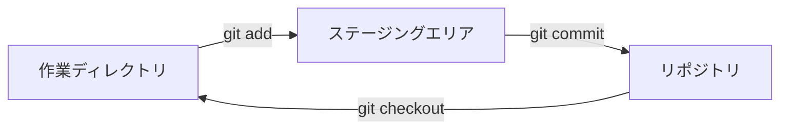

## ステップ 2: 最初のリポジトリを作成する

サンプルプロジェクトに慣れ、Git に自分が誰かを伝えたところで、ゲームをバージョン管理に入れましょう！

### 📖 理論: Git のワークフロー

Git のワークフローには3つの主要な領域があります:

- **作業ディレクトリ**: プロジェクトのファイルがあり、変更を行う場所。
- **ステージングエリア（インデックス）**: 履歴に保存したい変更をグループ化する準備エリア。
- **リポジトリ**: プロジェクトの開発履歴の永続的な記録。



### 重要な Git コマンドは？

Git には多くの操作がありますが、ローカルプロジェクトで最もよく使うものがいくつかあります。

- `git init` - バージョン管理を有効にする新しいリポジトリを開始する。
- `git add` - 関連する変更をステージングエリアにグループ化し、履歴に「コミット」する準備をする。
- `git commit` - ステージングエリアの変更をプロジェクトの履歴に保存（「コミット」）する。
  - コミットメッセージ - 履歴を整理するための変更の短い説明。
- `git status` - 作業ディレクトリとステージングエリアの現在の状態を表示する。
- `git checkout` - 作業ディレクトリをリポジトリ履歴の別のバージョンに変更する。

> [!TIP]
> コミットメッセージを軽視しないでください！明確で、簡潔で、説明的で、汎用的でないメッセージは、プロジェクトの履歴をはるかに理解しやすくします（そして将来のバグを見つけるのにも役立ちます）！

### ⌨️ アクティビティ 1: プロジェクトリポジトリを初期化する（CLI を使用）

ゲームにバージョン管理を追加して、現在のバージョンをコミットしましょう。

1. ターミナルでプロジェクトディレクトリに移動します。

   ```bash
   cd /workspaces/stack-overflown
   ```

1. 新しい Git リポジトリを初期化します。

   ```bash
   git init
   ```

1. リポジトリの状態を確認します。「No commits yet」と `git add` を使うヒントが表示されることに注目してください。

   ```bash
   git status
   ```

   

1. ゲームファイルをステージングエリアに追加します。これにより、リポジトリ履歴にコミットするための準備としてロックされたコピーが作成されます。

   ```bash
   git add src/index.html
   git add src/index.js
   git add src/patterns.js
   git add src/style.css
   ```

   または

   ```bash
   git add src/*
   ```

1. リポジトリの状態を再度確認します。各ファイルが `new file` として識別されていることに注目してください。

   ```bash
   git status
   ```

   

1. 変更をリポジトリ履歴にコミットします。これでプロジェクトの履歴が始まりました！ :octocat:

   ```bash
   git commit -m "初回コミット"
   ```

   

1. リポジトリの状態を確認します。「working tree clean」と表示されるのは、現在のコピーが履歴と完全に一致していることを意味します。

   ```bash
   git status
   ```

   

### ⌨️ アクティビティ 2: ファイルを操作する（VS Code を使用）

コードエディタでもファイルを追加してみましょう。ここではゲームのドキュメントを作成します。

1. ファイルエクスプローラーで、**新しいファイル...** アイコンをクリックして、以下の名前で README ファイルを作成します。`src/stack-overflown/` フォルダ内にあることを確認してください。

   ```txt
   README.md
   ```

   

1. ファイルを開いて、以下の内容を入力します。

   ```md
   # Stack Overflown

   スタックがオーバーフローする前に、落ちてくるブロックを現在のデバッグパターンに合わせよう！ ⏳
   ```

1. 左のナビゲーションで **ソース管理** タブを選択します。`README.md` ファイルが **変更** エリアに表示されていることに注目してください。

   

1. ファイルにカーソルを合わせてプラス記号 `+` ボタンを選択し、ステージングエリアに追加します。

   

1. コミットメッセージを入力して **コミット** ボタンを押します。

   ```txt
   ゲーム説明を追加
   ```

   

1. 2回目のコミットとして、`README.md` に以下の内容も追加します。

   ```md
   ## 開発方法

   - `index.html` - ゲームをプレイするためのコンテナ
   - `index.js` - メインのゲームロジック
   - `patterns.js` - ゲームプレイ中にマッチするエラーパターン
   - `style.css` - ゲームのフォーマットとスタイリング
   ```

1. 変更をステージングに追加し、以下のメッセージでコミットします。

   ```txt
   開発者向けドキュメントを追加
   ```

   

1. 新しいコミットがリポジトリに追加されたら、Mona がすでにあなたの作業を確認しているはずです。少し待ってコメントを見守ってください。進捗情報と次のステップが表示されます。

<details>
<summary>お困りですか？ 🤷</summary><br/>

- `git status` で間違ったファイルが表示される場合は、`git restore --staged <filename>` でステージングから削除できます。

</details>
