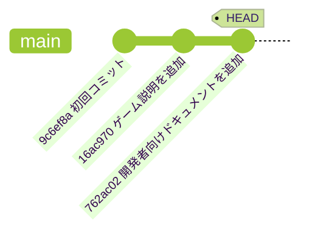

## ステップ 3: Git の履歴を探索する

ゲームが Git で追跡されるようになったので、どんな変更が行われたか、いつ行われたか、誰が行ったかを確認する方法を学びましょう。

### 📖 理論: Git の履歴を理解する

Git はコミットを通じてプロジェクトの完全な履歴を保持します。各コミットには以下が含まれます:

- **ユニークなハッシュ ID**: 履歴内で簡単に参照するためのユニークな識別子。
- **親コミット**: 前のコミットへの参照で、チェーンを形成します。
- **作成者情報**: 誰が変更を行ったか。
- **タイムスタンプ**: いつ変更が適用されたか。
- **コミットメッセージ**: そのコミットに含まれる変更の説明。

さらに、`HEAD` ポインタはプロジェクト履歴内での現在位置を示す特別なラベルです。あなたのプロジェクトは、おそらく以下のような図と似ているでしょう。



### 重要な Git コマンドは？

誰もが異なる方法で履歴を見ることを好み、コミュニティは多くのオプションを作成してきました。
ここでは、よく使うコマンドとオプションをいくつか紹介します。

- `git log` - プロジェクトの詳細な履歴を表示する。
  - `git log --oneline` - 1行に1コミットを表示。詳細は少ないが簡潔。
  - `git log --graph` - 分岐するパスに便利なビジュアル図を表示する。
- `git checkout` - 履歴の別の時点に移動する（作業ディレクトリのファイルが変更されます）。

### ⌨️ アクティビティ 1: 履歴を探索する（CLI を使用）

1. 詳細なコミット履歴を表示します。

   ```bash
   git log
   ```

   

1. 1行に1コミットで表示します。

   ```bash
   git log --oneline
   ```

   

1. コミット履歴の完全なビジュアルグラフを表示します。

   ```bash
   git log --graph --oneline
   ```

   > 🪧 **注意**: 今後のステップで履歴が長くなると、より面白い表示になります。

1. `初回コミット` エントリの **コミット ID** をコピーします。長い形式でも短い形式でも使えます。

1. それを使って以前のバージョンをチェックアウトします。

   ```bash
   git checkout <commit id>
   ```

   <br/>

   🪧 `README.md` ファイルが削除されたことに注目してください。
   
   

1. `main` の最新コミットに戻ります。`README.md` ファイルが復活したことに注目してください。 🧐

   ```bash
   git checkout main
   ```

   <br/>

   

### ⌨️ アクティビティ 2: 履歴を探索する（VS Code を使用）

1. 左のナビゲーションで **ソース管理** タブを開きます。

1. **変更** ヘッダーを右クリックして **グラフ** オプションを有効にします。

   

1. **グラフ** パネルを確認します。最近のコミットのタイムラインリストが表示されていることに注目してください。

   <br/>

1. コミット名をクリックして、そのコミットで変更されたファイルのリストを展開します。

   

1. Git 履歴の探索が終わったら、Mona がすでにあなたの作業を確認しているはずです。少し待ってコメントを見守ってください。進捗情報と次のステップが表示されます。

<details>
<summary>お困りですか？ 🤷</summary><br/>

- 履歴表示の利用可能なオプションをすべて見るには `git log --help` を使用してください。

</details>
