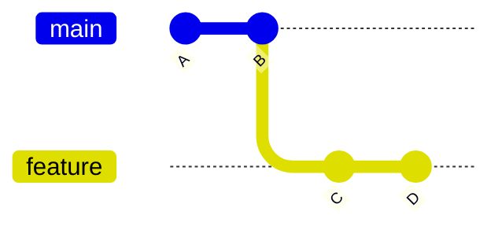
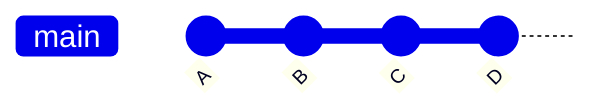
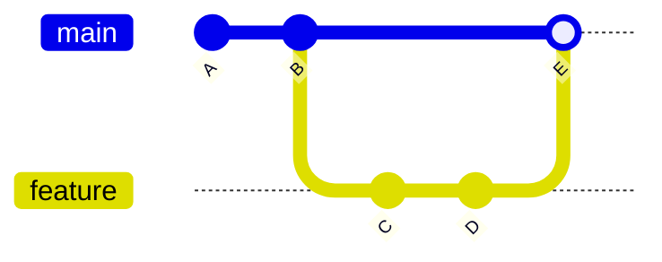
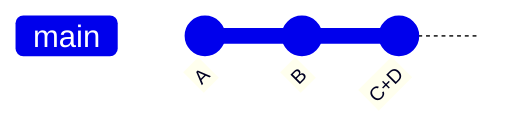

## ステップ 5: ブランチの活用

ゲームが追跡されるようになったので、いつでも動作するバージョンに戻れることが分かりました。また、履歴にコミットする変更を正確に確認できるので、無関係なものが含まれることもありません。

しかし、もっと疑問が出てきます！ 😱

「歴史がごちゃごちゃにならないようにするには？」

「未完成の作業による動作しないバージョンを履歴に残さないようにするには？」

「複数の機能/修正を同時に作業する必要がある場合は？」

### 📖 理論: ブランチを理解する

Git のブランチは特定のコミットへの軽量なポインタ（ラベルのようなもの）です。これにより、オリジナルに影響を与えずに依存バージョン上で作業できるため、並行機能開発やコラボレーションに最適です。

重要な概念:

- **`main` ブランチ**: 通常、信頼できる動作バージョンであり、最初のブランチ（歴史的には `master` と呼ばれていました）。
- **フィーチャーブランチ**: 信頼できるバージョンに影響を与えずに開発するための安全で隔離された空間。
- **マージ**: 異なるブランチの変更を統合すること。

### ブランチの統合方法は？

コミットを整理するための戦略は複数あります。通常、異なるスタイルの整理、透明性、追跡可能性を目的としています。最も一般的なものを紹介しましょう。

**ファストフォワードマージ**: 子ブランチの新しいコミットを親ブランチに移動します。

<div align="center">

**前:** オリジナル



**後:** ファストフォワードマージ



</div>

**マージコミット**: 変更を親ブランチ上の単一の新しいコミットとして適用します。追跡可能性のために子ブランチをネットワークに残します。

<div align="center">

**前:** オリジナル


**後:** マージコミット



</div>

**スカッシュマージ**: 一つのブランチのコミットを、もう一つのブランチ上の単一の新しいコミットにまとめます。

<div align="center">

**前:** オリジナル


**後:** スカッシュコミット



</div>

### 重要な Git コマンドは？

- `git branch my-new-feature` - 現在のブランチからブランチを開始する。
- `git checkout my-new-feature` - 作業ディレクトリをリポジトリ履歴の別のバージョンに変更する。
- `git merge` - あるブランチのコミットを別のブランチに適用する（デフォルト: ファストフォワードマージ）。

<!-- > [!TIP]
> `git reset --soft HEAD~1` で最後のコミットを簡単に「取り消す」ことができます。VS Code では、コマンドパレットで `Undo Last Commit` を検索してください。 -->

> [!TIP]
> Git 2.23 で `git switch` コマンドが導入され、ブランチ管理が簡素化されました。今後、より多く参照されるようになるでしょう。

<!-- Git 2.23 以降 -->
<!-- `git switch --create <ブランチ名>` -->
<!-- `git switch branch-name` -->

### ⌨️ アクティビティ 1: ブランチにコミットする（CLI を使用）

ブランチを作成して、変更をコミットする練習をしましょう。

1. 始める前に、履歴がどのようになっているか確認しましょう。完全に直線的（まだブランチなし）であることに注目してください。

   ```bash
   git log --all --graph --oneline
   ```

   

1. 新しいブランチを作成して切り替えます。

   ```bash
   git branch fix-incomplete-high-score
   git checkout fix-incomplete-high-score
   ```

1. 利用可能なブランチの一覧を表示します。

   ```bash
   git branch --list
   ```

   

1. `index.js` を開いて、ハイスコア機能を修正しましょう。

1. `41行目`に、ハイスコア用の変数を追加してコミットします。

   ```js
   let highScore = 0;
   ```

   ```bash
   git add src/index.js
   git commit -m "ハイスコア追跡用の変数を追加"
   ```

1. `61行目`に、ローカルストレージからスコアを読み込むコードを追加してコミットします。

   ```js
   // ローカルストレージからハイスコアを読み込む
   highScore = parseInt(localStorage.getItem("stackOverflownHighScore")) || 0;
   document.getElementById("high-score").textContent = highScore;
   ```

   ```bash
   git add src/index.js
   git commit -m "保存済みハイスコアの読み込みを追加"
   ```

1. `313行目`の `updateScore` 関数を、最高スコアを追跡するように置き換えてコミットします。

   ```js
   function updateScore() {
     document.getElementById("score").textContent = score;

     // 現在のスコアが上回った場合、ハイスコアを更新
     if (score > highScore) {
       highScore = score;
       document.getElementById("high-score").textContent = highScore;
       localStorage.setItem("stackOverflownHighScore", highScore);
     }
   }
   ```

   ```bash
   git add src/index.js
   git commit -m "最高スコアを追跡するロジックを追加"
   ```

1. 履歴グラフをもう一度見てみましょう。フィーチャーブランチが `main` ブランチよりも3つ多くのコミットを持ち、現在のバージョンを明確にする `HEAD` がフィーチャーブランチに付いていることに注目してください。

   ```bash
   git log --all --graph --oneline
   ```

   

1. `main` ブランチに戻ります。

   ```bash
   git checkout main
   ```

1. 新しい機能をマージします。

   > 🪧 **注意:** 学習のために「non fast forward」オプションを使用して、ブランチが履歴に見えるようにします。ビジュアル図がより面白くなります。

   ```bash
   git merge --no-ff fix-incomplete-high-score -m "ハイスコアトラッカーを修正"
   ```

   

1. 履歴グラフをもう一度見てみましょう。マージされた並行ブランチに注目してください。

   ```bash
   git log --all --graph --oneline
   ```

   

1. マージ済みで不要になったフィーチャーブランチのポインタ/ラベルを削除します。

   ```bash
   git branch --delete fix-incomplete-high-score
   ```

   > 🪧 **注意**: これはブランチの内容を削除するのではなく、参照に使われていた名前のみを削除します。

### ⌨️ アクティビティ 2: ブランチにコミットする（VS Code を使用）

1. 左のナビゲーションで **ソース管理** タブを開きます。**グラフ** パネルがまだ表示されていることを確認してください（ステップ3で有効にしたもの）。変更を加えながら更新を見守りましょう。

1. 下部のステータスバーの左側で、ブランチ名 `main` をクリックします。オプション付きのメニューが表示されます。

   <br/>

1. **新しいブランチを作成...** オプションを選択し、以下の名前を使用します。

   

   ```txt
   add-level-counter
   ```

   

1. `index.html` を開きます。`21行目`に、現在のレベルを表示する新しい要素を追加し、変更をコミットします。

   ```diff
   <h3>Level</h3>
   <div class="score" id="level">1</div>
   ```

   コミットメッセージ

   ```bash
   現在レベル表示の要素を追加
   ```

1. `index.js` を開いてレベルカウンターを追加しましょう。

1. `42行目`に、レベル追跡用の変数を2つ追加し、変更をコミットします。

   ```js
   let level = 1;
   let patternsCleared = 0;
   ```

   コミットメッセージ

   ```bash
   レベルとクリア数の変数を追加
   ```

1. `273行目`の `checkPatternMatch` メソッドを以下に置き換え、変更をコミットします。

   ```js
   function checkPatternMatch() {
     for (let startRow = 0; startRow <= ROWS - PATTERN_SIZE; startRow++) {
       for (let startCol = 0; startCol <= COLS - PATTERN_SIZE; startCol++) {
         if (matchesPattern(startRow, startCol)) {
           clearPattern(startRow, startCol);
           score += 100;
           patternsCleared++;
           if (patternsCleared % 5 === 0) {
             level++;
             dropInterval = Math.max(200, 1000 - (level - 1) * 100);
             document.getElementById("level").textContent = level;
           }
           updateScore();
           setNewTargetPattern();
           return;
         }
       }
     }
   }
   ```

   コミットメッセージ

   ```bash
   レベル計算ロジックを追加
   ```

1. **グラフ** パネルに、新しいコミット、以前のブランチ、そして元のコミットを含む全体の履歴が表示されていることに注目してください。

   

1. マージの準備として、ブランチ名を再度クリックして `main` ブランチを選択します。

   <br/>

   

1. 三点メニュー（`...`）をクリックし、`ブランチ` を選択して、`マージ...` を選択します。通常の**ファストフォワード**スタイルのマージが実行されたことに注目してください。

   <br/>

   <br/>

   

1. 三点メニュー（`...`）をクリックし、`ブランチ` を選択して、`ブランチの削除...` を選択します。

   <br/>

   

1. 両方のブランチがマージされたら、Mona がすでにあなたの作業を確認しているはずです。少し待ってコメントを見守ってください。進捗情報と次のステップが表示されます。

<details>
<summary>お困りですか？ 🤷</summary><br/>

- ブランチ名にタイプミスがあった場合は、`git branch --move old-name new-name` で名前を変更できます。

</details>
